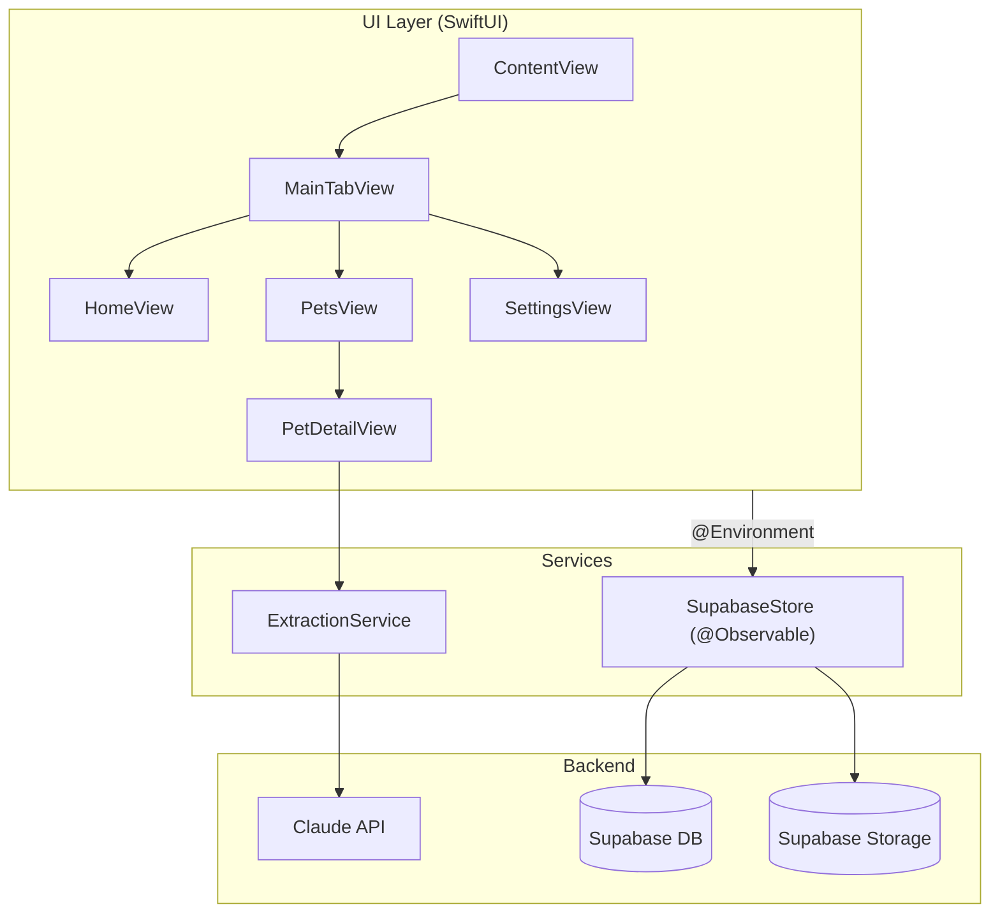

# Home

A personal iOS app for managing your household — pets, tasks, and everything in between.

Built with **SwiftUI**, **Swift 6 strict concurrency**, and **Supabase** as the backend.


---

## Features

### 🏠 Home Timeline
Unified feed of upcoming vet appointments and recurring household tasks, sorted by due date. One-tap actions: mark done, snooze, delete, add to calendar.

### 🐾 Pets
Per-pet detail pages with photo management (upload / crop / cache-bust), birthday and age display, and five data sections:

| Section | What it stores |
|---------|---------------|
| Vet | Primary veterinarian contact and clinic info |
| Appointments | Scheduled visits with status tracking (upcoming / done / cancelled) |
| Clinical History | Diagnoses, treatment notes, uploaded documents |
| Events | Milestones, grooming, training — any custom event |
| Files | Photos and PDFs with AI-powered document extraction |

### 🤖 AI Document Extraction
Upload a vet document (PDF or photo) and Claude parses it into structured `ClinicalEntry` data — diagnosis, notes, dates — ready to save with one tap.

### 📋 Household Tasks
Recurring tasks with configurable intervals, custom sections (with SF Symbol icons), and snooze/calendar integration.

---

## Architecture



`SupabaseStore` is the single source of truth — created once in `ContentView`, injected app-wide via `.environment`. No caching layer, no view models. See [`docs/architecture.md`](docs/architecture.md) for the full module dependency graph.

Data model: [`docs/data-model.md`](docs/data-model.md) · User flows: [`docs/user-flows.md`](docs/user-flows.md)

---

## Getting Started

**Prerequisites:** Xcode 16+, a Supabase project.

1. Clone the repo and open `Home.xcodeproj`.

2. Create `Config.xcconfig` at the repo root:

```
SUPABASE_URL = https://your-project.supabase.co
SUPABASE_ANON_KEY = eyJ...
```

3. Apply the database schema:

```bash
supabase db push
```

4. Build and run (`Cmd+R`).

---

## Tech Stack

| Layer | Technology |
|-------|-----------|
| UI | SwiftUI + Swift 6 strict concurrency |
| State | `@Observable` (`SupabaseStore`) |
| Backend | Supabase (PostgreSQL + Storage) |
| AI | Claude API (document extraction) |
| Auth | Supabase Auth |
| Calendar | EventKit (`CalendarService`) |
