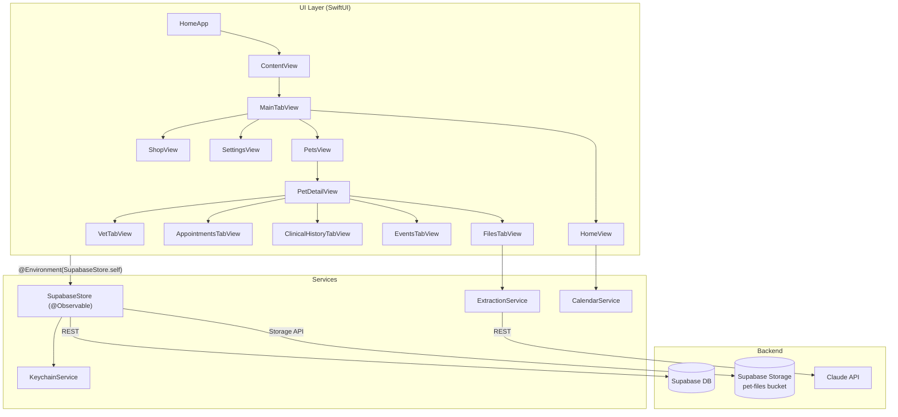
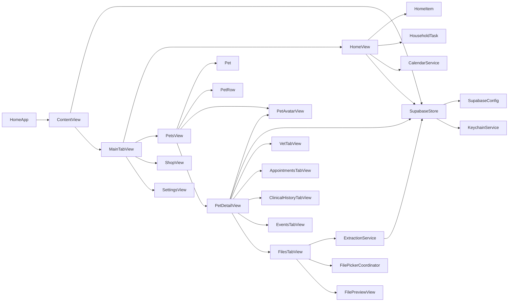

# Architecture

## App Layer Diagram

`SupabaseStore` is created once in `ContentView` and passed down via `.environment(store)`. Every view reads and mutates app state through it — no local caches, no view models.

---

## Module Dependency Graph

